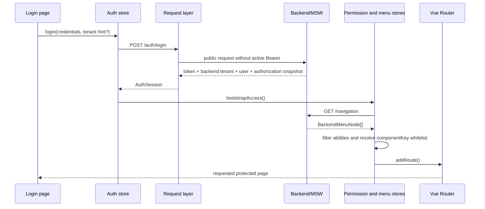

# Admin architecture

This document defines the production boundaries of the template. Pages remain composition surfaces; cross-page or persisted state lives in Pinia, while server-owned list and detail data lives in Vue Query.

## Module boundaries

| Boundary           | Owns                                                                                             | Does not own                 |
| ------------------ | ------------------------------------------------------------------------------------------------ | ---------------------------- |
| `bootstrap`        | plugin installation, persisted settings activation, global auth failure callbacks, MSW startup   | page data                    |
| `appearance`       | theme, semantic colors, locale, component density, layout and interface preferences              | route state                  |
| `auth`             | access token, expiry/session metadata, current user, authentication provider and optional tenant | menu or page data            |
| `request`          | API envelope, timeout, auth headers, dedupe, upload/download and error policy                    | router decisions             |
| `permission`       | CASL rules and data-scope claims                                                                 | backend authorization        |
| `navigation`       | backend menu compilation, safe component registry, dynamic route disposal                        | business permissions         |
| `tabs`             | visited routes and KeepAlive names                                                               | server query cache           |
| `session boundary` | principal-change events and protected Query/notification cleanup                                 | feature payloads             |
| feature modules    | route page, focused components, Vue Query calls and feature validation                           | application-wide preferences |

## Directory shape

```text
src/
├── components/
│   ├── ui/                 # reka-ui/shadcn-vue primitives
│   ├── admin/              # reusable business components
│   ├── data-table/         # TanStack table primitives
│   └── layout/             # shell chrome and settings entry
├── features/
│   ├── account/            # profile and password flows
│   ├── component-gallery/  # executable business-component examples
│   ├── content-admin/      # announcements, real file bytes and operation logs
│   ├── dashboard/          # source-backed operational overview
│   ├── departments/        # organization hierarchy
│   ├── dictionaries/       # type/entry management and option projection
│   ├── form-workbench/     # validated multi-step form vertical slice
│   ├── menus/              # backend menu and permission identifiers
│   ├── monitoring/         # sessions, logs, services, jobs and caches
│   ├── navigation/         # backend menu contracts and compiler
│   ├── notifications/      # message center and realtime transport
│   ├── positions/          # position management
│   ├── users/              # user vertical slice
│   ├── roles/              # role, permission and data-scope policy
│   ├── system-config/      # grouped public/secret configuration
│   └── system-parameters/  # generic key/value configuration
├── layouts/                # configurable application shells
├── lib/                    # HTTP, CASL, tokens and framework adapters
├── mocks/handlers/         # MSW endpoints grouped by module
├── pages/                  # thin route composition surfaces
├── router/                 # static routes, guard and dynamic registration
├── stores/                 # persistent/cross-page state only
└── i18n/                   # zh-CN and en-US messages
```

<!-- AI modified: document the executable public-entry rule introduced by the Phase 3 boundary gate. -->

Cross-feature imports use `@/features/<feature>` and expose only members with real consumers. A feature cannot reach another feature's internal file, and shared/application layers (`components`, `config`, `lib`, `stores`, `types`) also consume feature contracts through these public entries. Feature modules cannot import Router, Layout or Page layers; `features/navigation/navigation-contract.ts` is the single exception because it is the audited safe-key-to-lazy-page registry. Knip supplies the static cycle gate, while `check:boundaries` enforces deep-import and direction rules.

## Core contracts

```ts
type LayoutMode
  = | 'sidebar'
    | 'top'
    | 'mixed'

type ComponentSize = 'default' | 'sm' | 'md' | 'lg'
type DataScope = 'self' | 'department' | 'departmentTree' | 'custom' | 'all'

interface AuthSession {
  token: string
  expiresAt: number
  tenantId: string | null
  user: AdminUser
  authorization: AuthorizationSnapshot
  provider: 'password' | 'sso'
}

interface BackendMenuNode {
  id: string
  kind: 'menu' | 'external' | 'iframe'
  titleKey: string
  path?: string
  routeName?: string
  componentKey?: string
  icon?: string
  externalUrl?: string
  iframeUrl?: string
  hidden?: boolean
  order?: number
  keepAlive?: boolean
  cacheKey?: string
  requiredAbility?: { action: AppAction, subject: AppSubject }
  permissionIdentifier?: string
  children?: BackendMenuNode[]
}

interface ManagedMenuInput {
  parentId: string | null
  kind: 'menu' | 'external' | 'iframe'
  titleKey: string
  path: string
  targetUrl: string
  routeName: string
  componentKey: ManagedMenuComponentKey | ''
  icon: ManagedMenuIconKey
  permissionIdentifier: string
  requiredAbility?: { action: AppAction, subject: AppSubject }
  hidden: boolean
  keepAlive: boolean
  order: number
}

interface SystemParameterRecord {
  id: string
  key: string
  value: string
  description: string
  status: 'active' | 'disabled'
  updatedAt: string
}

interface UserImportResponse {
  createdCount: number
  skippedCount: number
  issues: Array<{
    row: number
    code: UserImportIssueCode
  }>
}

interface UpdateRolePolicyInput {
  permissions: RolePermission[]
  dataScope: DataScopeGrant
}

interface ApiEnvelope<T> {
  code: number | string
  message: string
  data: T
}
```

The access token is scoped to browser `sessionStorage` so it does not survive a tab session; persistent `localStorage` credentials are deleted and never accepted for authorization. This template intentionally has no JavaScript refresh-token API. A production backend that needs renewal must own it through a `Secure`, `HttpOnly`, `SameSite` cookie and rotate it server-side.

角色策略接口把 `permissions` 与 `dataScope` 作为同一事务保存，并随角色列表返回可选择的部门快照；`RolePolicy` 是独立 CASL subject，不与普通 `Settings` 配置权限混用。

`mixed` is the compatibility identifier for the Dual Sidebar / Split Sidebar layout. The UI label exposes the business layout name while persisted settings retain a stable value.

<!-- AI modified: document the single Shell geometry and responsive contract consumed by every layout. -->

## Shell and responsive contract

The three formal layouts are resolved through `getAdminLayoutDefinition()`. A definition owns `brandPlacement`, `collapseTarget`, `childPresentation`, grid areas, and the single `1024px` desktop breakpoint. Retired experimental layout identifiers migrate to the nearest formal layout when persisted settings are read. Desktop navigation is hidden below that breakpoint and the mobile navigation trigger is hidden at and above it, so the two entry points never overlap.

- A navigation/content boundary is drawn by exactly one visible sidebar. Breadcrumb lives in the Header; Tabs own the separate page-context row and its bottom border.
- Expanded sidebar, compact rail, mixed secondary navigation, and flyout widths are `240px`, `72px`, `240px`, and `280px` respectively.
- `sidebarDefault` is the persisted startup preference; the current expanded/collapsed state belongs to the active Shell and is not written back by a manual toggle.
- Mixed layout keeps its primary rail and collapses the secondary sidebar to zero width, rather than producing two adjacent rails.
- Compact branches open a focus-managed flyout. Deep inline branches cap indentation and draw a hierarchy rail only at the first child level.
- Header navigation measures its translated labels and available DOM width. It degrades from complete root navigation to a `More` menu; below the desktop breakpoint it yields to the mobile menu. Search becomes icon-only only while top-navigation overflow needs the space.
- Appearance controls are rendered only when the active layout contract can apply them. The internal-scroll Shell makes sticky Header configuration inapplicable, so it is not presented as an ineffective setting.
- `ConfigurableAdminLayout` plus `AdminNavigation` is the authoritative application Shell contract. The unused `components/ui/sidebar` set remains a low-level shadcn-vue primitive for Gallery evaluation and does not own persisted or runtime navigation state.

## Display locale and timezone contract

Visible dates, numbers, currency, percentage points, and file sizes use the functions in `src/lib/display-format.ts`. Callers must pass the active application locale; date/time callers must also pass an explicit business timezone. Empty or invalid display input renders `—`, percentage helpers accept percentage points (`6.4` renders as `6.4%`), and currency identifiers must be uppercase ISO 4217 codes. The current template default is `Asia/Shanghai`; tenant-configurable timezone support can replace that constant without changing component call sites.

## Authentication and navigation sequence



Only known `componentKey` values can resolve to lazy Vue components. A backend response can choose from that registry but cannot provide an import path or executable code.
The menu editor, Mock write API, and `/navigation` runtime projection share the same target contract and URL policy. Internal routes require their path/name/component triplet, external links exclude route fields, and iframes require the fixed `iframe` component. Rejected targets return `422` field errors before persistence; accepted writes are projected into the live tree and trigger dynamic-route reload.

## Authorization and data scope

CASL controls route, menu and component visibility for user experience. Backend/MSW handlers independently validate the token and permission for every protected operation.

- `all`: every record within the tenant.
- `departmentTree`: the current department and descendants.
- `department`: the current department only.
- `self`: records owned by the current user.
- `custom`: explicit department identifiers issued by the backend.

Data-scope claims are request constraints, not client-side filters. Hiding a button is not authorization.

## Loading and errors

- Router navigation uses one thin global progress indicator.
- Vue Query owns page, table and detail loading/error states.
- Mutations disable the initiating control and surface a local success/error toast.
- `401` clears the session once and redirects to login with the current URL as `redirect`.
- An ordinary authorization `403` preserves the session, shows an authorization message and lets guards render the forbidden page. Explicit terminal account/session codes invalidate the session while preserving the received HTTP status.
- Offline status is shown globally; a temporary network failure does not clear a valid session.
- File management uploads original binary bytes with safe filename and MIME headers; the backend repeats extension, MIME and byte-size validation.
- User import sends original UTF-8 CSV bytes, validates canonical `name,email,role,status[,createdAt]` columns, limits size/rows, reports skipped row codes, and protects role assignment separately from ordinary user editing.

The full applicability matrix and the allowlisted Tab, tree, dictionary/category, and detail-Drawer query keys are defined in [`page-state-and-url-contract.md`](./page-state-and-url-contract.md). Pages compose only relevant states; global Offline, Forbidden, and Session Expired boundaries are not duplicated inside every feature.

## Persistence

Only the following data is persisted:

- authentication token/session metadata;
- appearance and interface preferences;
- dynamic menu metadata and open tabs where safe;
- bounded dictionary cache and principal-bound notification read projection.

Vue Query response data, form state and server lists are deliberately not persisted in Pinia. Logout, `401`, tenant changes and account changes clear the protected Query cache and bind notification persistence to the new principal before protected data can render.
